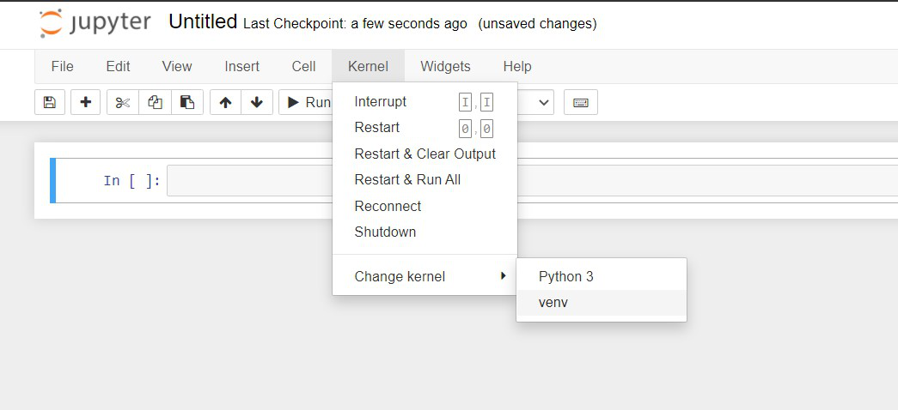

## Prepare Development Environment

We will be using `Poetry`, a versatile tool for Python projects that simplifying dependency management and packaging. It automates the process of declaring, installing, and updating the libraries your project relies on. By using a lockfile, `Poetry` guarantees consistent and reproducible builds, ensuring that your project's dependencies are always installed in the specified versions. Additionally, `Poetry` provides convenient features for building your project into distributable formats, making it easier to share and deploy your work.

1. Install [Python](https://www.python.org/downloads/) (both 3.10.12 and 3.12.6 were used in testing to offer a wide range of diversity.) 

1. Install [Poetry](https://python-poetry.org/docs/#installing-with-the-official-installer).The flexibility of poetry makes it best of breed as it plays well with `pip` and `conda` alike. 

1. Install [ffmpeg](https://www.ffmpeg.org/download.html) 

   - Windows

        To simplify setup for windows users, `ffmpeg.exe` and `ffprode.exe` have been included in this repo under `libs` directory. For other operating systems, please reference below.
    
   - Mac 
     - **For MacOS Monterey v12 and below:** We will be using MacPorts. Homebrew is no longer supported for these MacOSx versions. 
       - Install Apple's CLI Developer Tools (If required): `xcode-select --install`
       - Download and install [**MacPorts**](https://www.macports.org/install.php) for the version of your Mac operating system.  
     
     - **For Mac OSX Ventura and above:** We will be using `brew` but first we must make sure that it's up-to-date.  

       1. First update `brew`.  

             ```bash
             brew update
             ``` 
             > **NOTE:** if you get an error like `fatal: couldn't find remote ref refs/heads/master` when trying to run `brew update`, the possible culprit is `dart-lang` changing it's default branch from `master` to `main`. To resolve this run the following set of commands:

             ```bash
             brew tap --repair && brew cleanup && brew update-reset
             ```

             Now you should be able to run `brew update`.

       2.  Next, we can upgrade the outdated `brew` formulae. 

             ```bash
             brew upgrade
             ``` 
             > **NOTE:** You might need to run this a few times to get all outdated formulae successfully updated. Depending on how outdated packages are, this may take some time to complete. Please be patient. This is a good time to grab a `brew` :) 

         1.  We can now install the latest/stable version of `ffmpeg` in Homebrew.  
             ```bash
             brew install ffmpeg
             ```
      


   - Linux  
      Install using the following command:

      ```bash
      apt install libasound2-dev portaudio19-dev libportaudio2 libportaudiocpp0 ffmpeg
      ```

3. Create a Virtual Environment, and install libraries needed, using a Linux shell or **git bash** in Windows

    - Windows

        ```bash
        python -m venv .venv
        .venv/Scripts/activate
        ```

    - Linux/Mac

        ``` bash
        python3 -m venv .venv
        source ./.venv/bin/activate
        ```

    - Mac Only

        **Prerequisites**  

        One of the requirements is [PyAudio](https://pypi.org/project/PyAudio/). According to their instructions we need to use Homebrew to install the prerequisite `portaudio` library before we can install `PyAudio`.  

        ```bash
        brew install portaudio
        ```
1. Install the code, from the root directory that contains `pyproject.toml` file, using `poetry`.
    ```bash
    poetry lock 
    poetry install
    ```

4. Install `playwright`, an open-source tool for automating web testing in python. We'll use it to get some data for our LLM.
    ```bash
    playwright install
    ```

5. Test Environment
    
    Run the command below to make sure the virtual environment is activated.
    
    ``` bash
    python -V
    ```

    Create an OpenAI Account and Obtain a Key
    
    1. Follow the instructions [here](https://platform.openai.com/docs/quickstart) to create your key.
    2. Make a copy of [.env_template](.env_template) and rename it to `.env`. Then add your key in the `.env` file as shown:
    ```bash
    OPENAI_API_KEY="<YOUR_KEY_GOES_HERE>"
    ```

## Project Directory Overview  

The project is structured in a modularized manner, focusing on building and running chatbots with voice capabilities. It has a good separation of concerns with well-defined directories for different functionalities. Such as `bots`, `data_utils`, and `models`, promoting code reusability and maintainability. It offers various voice capabilities, including text-to-speech, speech-to-text, and voice-based interactions, making it suitable for creating interactive chatbot applications.

#### **Key Directories:**

* **app:** Contains the main application files:
    * `chatbot_gradio_runner.ipynb`: Jupyter notebook for running the chatbot interactively.

    * `chatbot_gradio_runner.py`: Python script for running the chatbot with Gradio for a web interface.

* **data:** Stores various types of data for chatbots. This is primarily used for LLM context for different bots:

    * `travel_bot_context.txt`: This is the context we'll use for the chat assistant today.

    * Other files with specific chatbot contexts (financial, call center, etc.).

    * CSV and JSON files formats to allow flexibility.
* **genai_voice:** Core project code:
    * **bots:** Code specific to implementing chatbots (`chatbot.py`).
    * **config:** Configuration files (`defaults.py`).
    * **data_utils:** Utilities for data handling and gathering data from websites (e.g., `extract_web_data.py`).
    * **defintions:** Defines response formats and prompts for chatbots.

    * **logger:** Custom utility for logging information.

    * **models:** Code for managing and interacting with language models (`open_ai.py`).

    * **moderation:** Code for handling and filtering chatbot responses.

    * **processing:** Functions for processing audio data (`audio.py`).

* **libs:** External libraries used by the project (ffmpeg binaries for Windows only).

* **poetry.lock** and **pyproject.toml**: Poetry-related files for dependency management.

    
## Launch Notebook

1. We need to be able to point Jupyter notebook to our virtual environment that has the right packages and libraries.  

    ```bash
    ipython kernel install --user --name=.venv
    ```

1. Run the command below from the virtual environment to launch the [notebook](app/chatbot_gradio_runner.ipynb) in a browser. Once ran, select the `venv` kernel and continue executing the cells.



    ``` bash
    jupyter notebook app/chatbot_gradio_runner.ipynb
    ```
2. You can also run the same chatbot directly from a python script using `poetry`. 
    ```bash
    poetry run RunChatBotScript
    ```


## Troubleshooting
1. Try and use a headset microphone
2. Record in a quiet room 
3. Make sure that you have granted microphone permissions
4. Ensure the required audio libraries are installed
